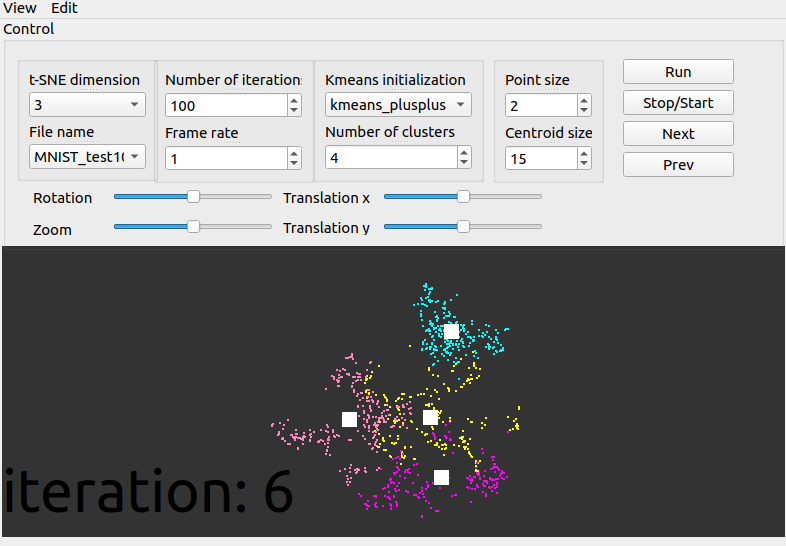

# Visualize Kmeans clusters after t-SNE

## dependencies
* Qt5
* OpenGL

## usage
Prepare the data file in the `data` directory, we could download the [MNIST dastset](https://lvdmaaten.github.io/tsne/code/mnist.zip) from the author of t-SNE.

We implemented Kmeans and the visualization part with C++ and OpenGL, then incorporated the official implementation of t-SNE into our codes.

We can test our Qt application with different settings, we could select the data and manually enter paramenters, such as the number of clusters and the dimension of the data according to t-SNE.

Once we click on the `Run` button, the application will immediately display the result of the visualization. We could click the `Next/Prev` button to check the Kmeans clustering results for the next or previous iteration. The application would start or stop the animation of Kmeans iterations once you click the `Stop/Start` button.

## references
This repo is built upon the official c++ implementation of [t-SNE](https://github.com/lvdmaaten/bhtsne/)